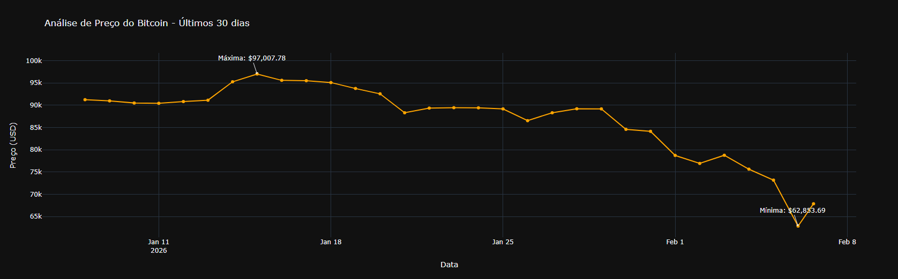
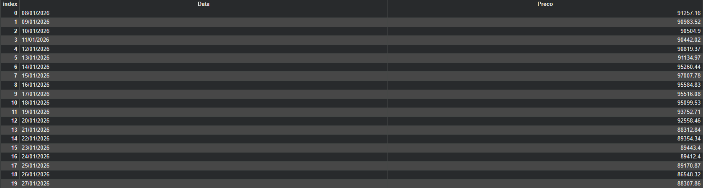
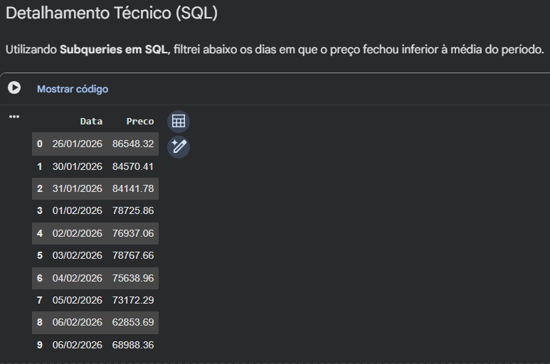

# 📉 Análise de Preço: Bitcoin (BTC)

Projeto desenvolvido para análise técnica simplificada do Bitcoin nos últimos 30 dias, utilizando dados em tempo real da API CoinGecko e armazenamento em banco de dados relacional (SQL).

## 🛠️ Tecnologias Utilizadas
* **Python**: Lógica de extração e manipulação.
* **Pandas**: Limpeza e tratamento de dados.
* **SQLite**: Banco de dados para consultas estruturadas.
* **Plotly**: Visualizações interativas.
* **CoinGecko API**: Fonte de dados em tempo real.

---

## 1. Visualização do Gráfico
A primeira etapa consiste em transformar os dados brutos da API em um gráfico. O gráfico permite observar a volatilidade do Bitcoin e identificar tendências de preço.

---

## 2. Persistência e Integridade do Banco de Dados (SQL)
Os dados coletados são armazenados em um banco SQLite para garantir a persistência. Abaixo, uma amostra dos primeiros registros estruturados:

---

## 3. Insights via SQL
Utilizando queries estruturadas, o sistema identifica automaticamente os dias em que o Bitcoin operou abaixo da média do período, sinalizando possíveis janelas de oportunidade.

---

### 📂 Como Executar
1. Clone o repositório.
2. Abra o arquivo `.ipynb` no Google Colab ou Jupyter.
3. Pressione **Ctrl + F9** ou vá em **Ambiente de Execução > Executar tudo** para executar todas as células automaticamente.
